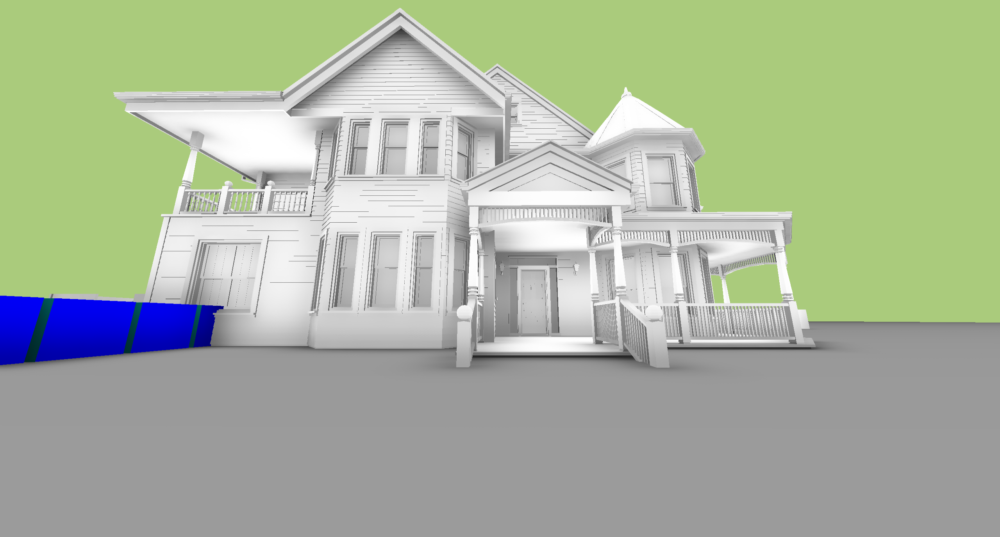
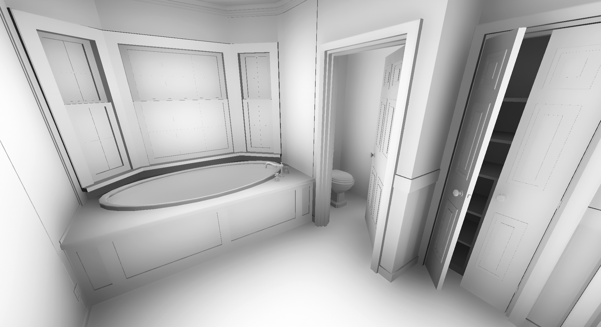
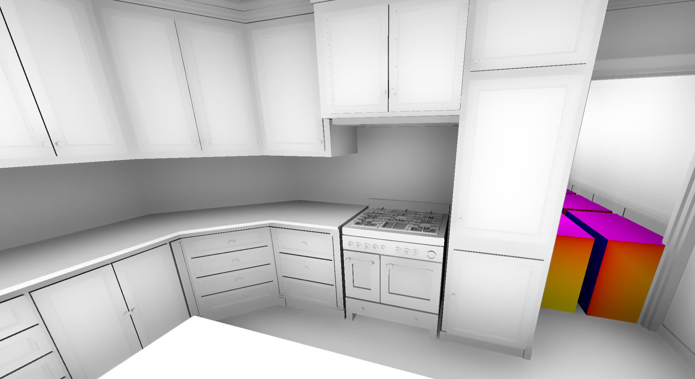

# D3D12 Engine Test

__Project creation date:__ 06.06.2020

## Description
This project is a test of ambient occlusion using the DirectX 12 Raytracing API.

## Implementation
In order to improve the usability of DirectX a small Engine has been writen. This Engine is located in the [Engine folder](D3D12_Engine_Test/Engine).\
The Engine is the same as in the project [Slime Simulation](https://github.com/MarvinOtt/SlimeSimulation).\
The main application files are located in the src folder.

## Technologies
* C++
* DirectX 12
* DXR

## Requirements
* Windows 10
* GPU with DirectX 12 Raytracing support
* [Visual C++ Redistributable x64](https://support.microsoft.com/de-de/topic/aktuelle-unterst%C3%BCtzte-downloads-f%C3%BCr-visual-c-2647da03-1eea-4433-9aff-95f26a218cc0)

## Remarks
The raw raytracing output is extremely noisy and the filtering is quite bad in some situations.

## Pictures

***

***

